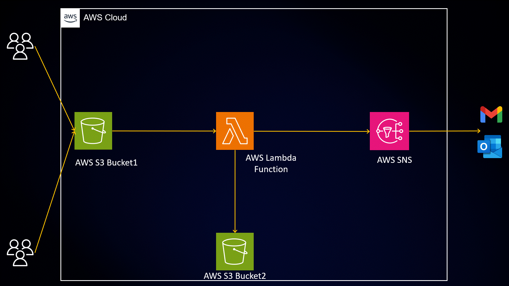

# Image-Resizing-Pipeline-with-AWS-S3-Lambda-and-SNS
In this repository, we will explore how to automate image resizing using AWS S3, Lambda, and SNS, enabling efficient image management and delivery.

## Introduction:

In today’s digital age, images play a crucial role in various applications and websites. However, managing and serving images of different sizes can be a challenging task. To overcome this challenge, we can leverage the power of cloud computing and automation to resize images on-the-fly.

let’s dive into the implementation details and automate the image resizing process step by step. By the end of this blog post, you will have a fully functional system that can automatically resize images and store them in a separate bucket, while notifying a subscribed email address about the successful resizing process.

## Let’s get started!

In this project, we will be creating `two buckets`. The first bucket will be used to store the `original images` that we want to resize. The second bucket will be dedicated to storing the `resized images`. The resizing process will be automated through an `AWS Lambda function`, which will automatically upload the resized images to the `second bucket.`

### 1. Creating the first S3 bucket by clicking on `Create bucket.`

### 2. Enter the name of `Bucket1` and click on `Create bucket.`

### 3. Enter the name of `Bucket2` and click on `Create bucket.`