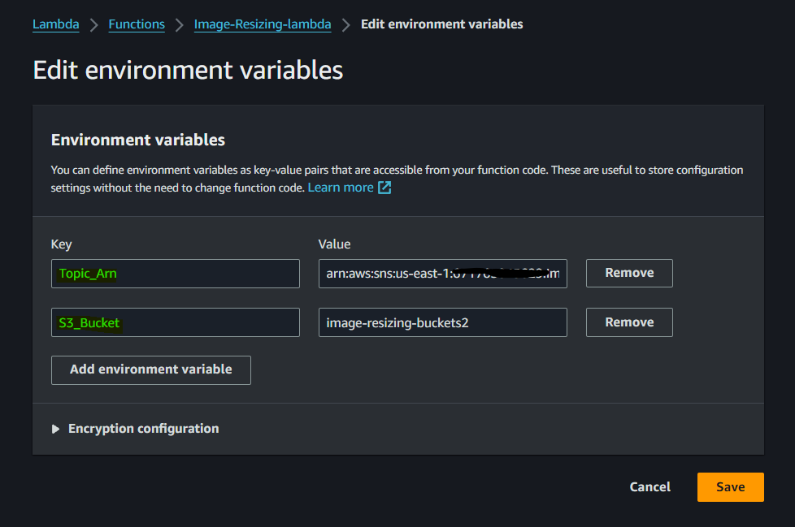
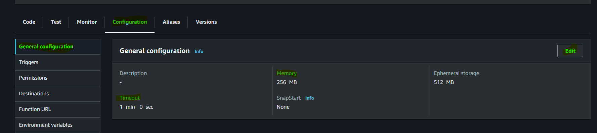
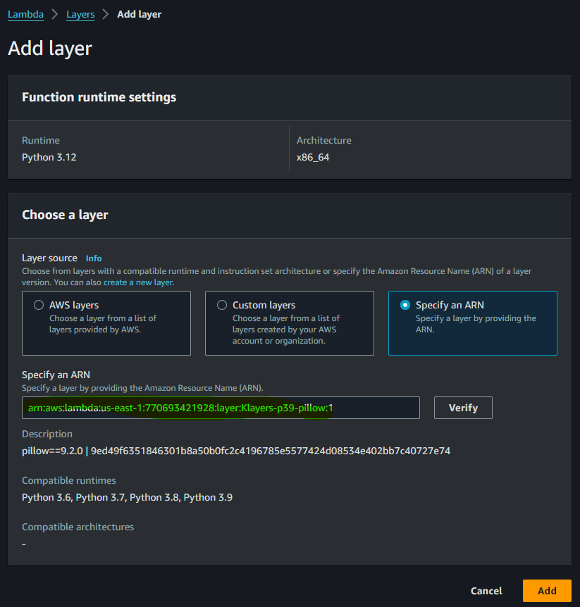

# Image-Resizing-Pipeline-with-AWS-S3-Lambda-and-SNS
In this repository, we will explore how to automate image resizing using AWS S3, Lambda, and SNS, enabling efficient image management and delivery.

## Introduction:

In today’s digital age, images play a crucial role in various applications and websites. However, managing and serving images of different sizes can be a challenging task. To overcome this challenge, we can leverage the power of cloud computing and automation to resize images on-the-fly.

let’s dive into the implementation details and automate the image resizing process step by step. By the end of this blog post, you will have a fully functional system that can automatically resize images and store them in a separate bucket, while notifying a subscribed email address about the successful resizing process.

## Let’s get started!

In this project, we will be creating `two buckets`. The first bucket will be used to store the `original images` that we want to resize. The second bucket will be dedicated to storing the `resized images`. The resizing process will be automated through an `AWS Lambda function`, which will automatically upload the resized images to the `second bucket.`

### 1. Enter the name of `Bucket1` and click on `Create bucket.`

### 2. Enter the name of `Bucket2` and click on `Create bucket.`

### 3. Now, let’s create an `SNS topic` and an `SNS subscription` before creating a `lambda function.` First click on Create topic. Select Standard type SNS topic and enter the suitable name for your SNS topic and click on `Create topic.`

### 4. As you can see in the below screenshot, we have configured the SNS topic. Now, click on `Create subscription` to add your `email address.`

### 5. After creating Subscription, you will get a notification on your given mail address if not, please check your spam box. The mail will look like the below screenshot.

* Click on Confirm subscription to get the notification for the resized image.

### 6. Once you confirm your subscription. The status should be `Confirmed` from Pending status.

* Here, we configured the SNS topic and subscription.

### 7. Now, Let’s create a `Lambda function` that will help us to resize the images and store the images. Click on `Create function.` Enter the `function name`, `runtime(I am using Python 3.9)`, and `architecture`, and for role select the first option, So we can configure from our own all the access for the services and click on Create function.

### 8. First of all, replace the code with our code that will resize the image. Copy the code `Lambda-Code`, After replacing the code, deploy it by clicking on Deploy.

### 9. Now, we need to configure lots of things in the lambda function. Let’s start with `runtime settings`, that is, exactly under the code itself. `Click on Edit` Now, add the `handler name` according to your Python code name and click on Save.

* My lambda function code name is `lambda-code` and handler name is `handler`. So, I have written `lambda-code.handler.`

### 10. In our Python code, we have to provide `Bucket2- resized-bucket name and SNS topic Arn`. But instead of hardcoding it, we will use Lambda environment variables and we will pass our information.

* To do that, Go to the `configuration section`, under click on `Environment variables`, and click on `edit.`
* Add the SNS topic arn and S3 bucket name of Bucket2 according to your service name and on and click on Save.

### 11. In the lambda function, we have to increase the `timeout and Memory size` because the lambda function needs more time and memory to perform the resizing task.

* To do that, Go to the `Configuration tab-> General configuration section -> click on edit`. Add the `timeout 1 min and give memory 256MB`. 
* It would be enough to perform our task.

### 12. Now, we need to add one `PIL layer for our Python code.`

* Click on Add a layer.
* Add the ARN of the layer arn:aws:lambda:us-east-1:770693421928:layer:Klayers-p39-pillow:1 and click on Save.

### 13. Let’s do the `IAM role configuration for our Lambda function.` Go to `IAM -> roles -> ‘search for your lambda name role’` and click on the role.

* Here we have only one permission that is related to see the logs of our lambda function in loggroup. But we need two more permissions which is `SNSFullAccess` to send the mail to the person and `S3FullAccess` to get the images and store the images in the respective buckets.
* To do that, Click on `Add permissions and select Attach policy.`

### 14. Now, find the two permissions one by one `SNSFullAccess and S3FullAccess,` and check the box on the left of the permissions. After doing both, click on Add permissions.

The final IAM role has the below permissions list.

### 15. Finally, We have to add a `trigger for the Lambda function.` So whenever someone uploads an image to Bucket1. The lambda function will trigger and start the process of resizing the image and doing the other respective things.

* Add the S3 as `source,` Bucket1 which will trigger the Lambda function, and click on Add.

### 16. Now, we have configured all the things related to the Lambda function. It’s time to test it.

* To do that click on Test -> Configure test event.

